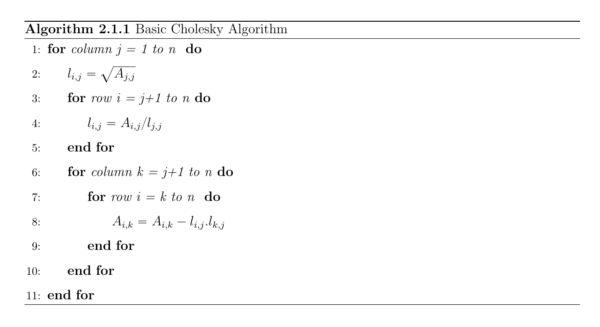
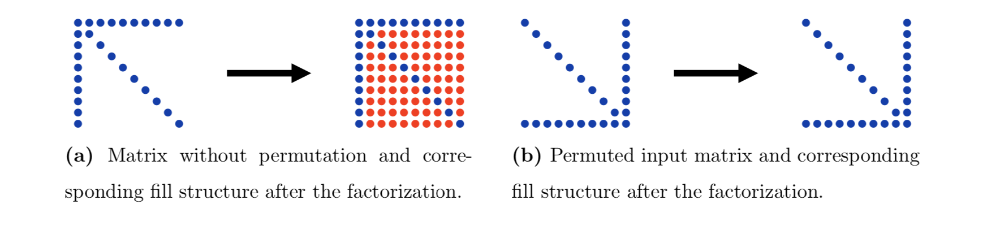
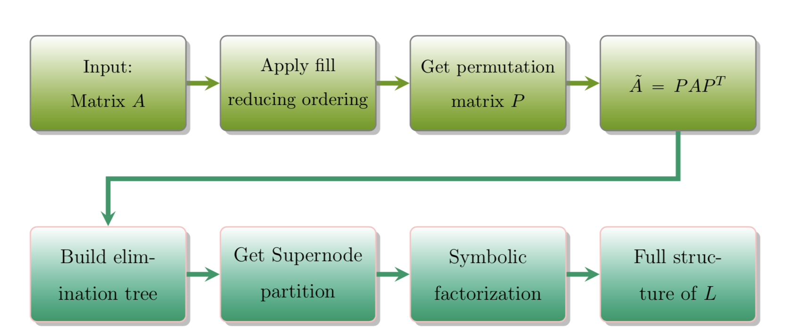

# Research Project: Direct Methods for Solving Sparse Linear System (Lawrence Berkeley National Laboratory, CA)

## Abstract:
 Multiple methods are available in the literature to solve a linear system. They are generally classified in two categories, direct methods and iterative methods. In this work, we focus on solving a sparse linear system  _Ax = b_, where *A* is symmetric positive definite. In this case, forward and backward triangular solve can be used after the Cholesky decomposition of matrix _(A = LL^T)_
 has been computed. In this work, we explore the use of Block Low- Rank Compression(BLR) in the left-looking Cholesky algorithm. To this end, we investigate sorting the updaters to a certain target block during the factorization process and it's impact on rank growth.we compare the results with a regular factorization process without sorting the updates to see the growth of the rank of the target block.

## Introduction:
Large sparse matrices  appear in scientific applications in numerous fields including discretized PDEs, optimization problems, circuit design, structural dynamics and many more.  Solving  large sparse linear systems is an important issue in academic research and in industrial applications. The development of supercomputers has provided us with the opportunity to solve these critical problems . These challanges brought some new issues such as memory consumption, accuracy, and speed, which are encountered daily by numerical analyst and mathematicians. 
## Algorithm for Cholesky Factorization
The following pseudocode (2.1.1) describes the procedure for obtaining _A = LL^T_ factorization for positive definite matrix _A_.

If we apply algorithm (2.1.1) to the sparse matrix _A_ then it suffers from _fill_ which means that _L_ has nonzeros in positions which are zero in the lower triangular part of _A_ .This  is one of the major problems in sparse solvers. We want to exploit the sparsity pattern of the matrix as much as possible to save the storage cost as well as the number of floating point operations during the factorization.  For example, we can observe the following two different situations to realize how permuting the matrix in the right order can reduce the cost of computations and helps to exploit the sparsity of the given matrix.

In this regard, we want the symmetric permutation to reorder the rows and columns of the matrix _A_ to keep _A_ symmetric and reduce the fill-in entries to the factorization.
## Organization of the factorization
As we discussed, fill-in is the major issues in the direct methods for solving large sparse linear system. So we have to do pre-processing to arrange the original matrix _A_ to get a full structure of _L_ as shown in the following diagram.

