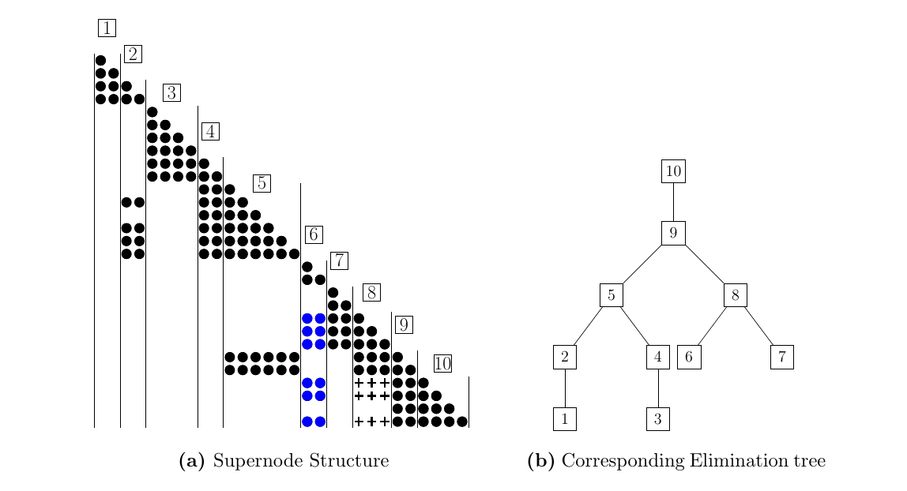
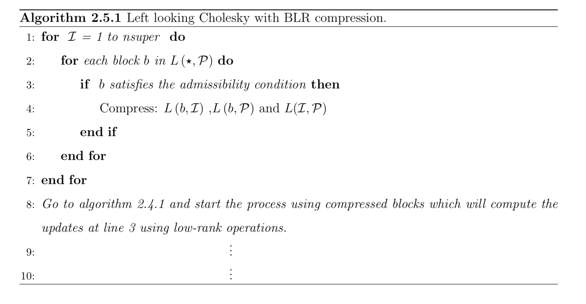
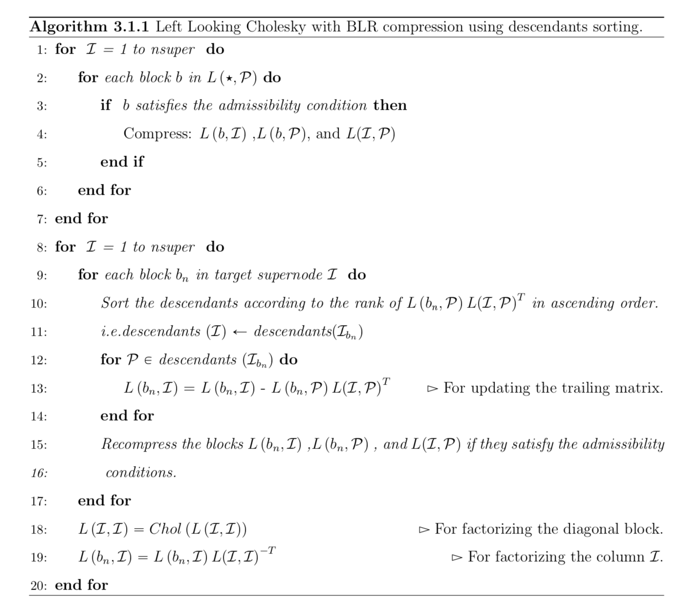
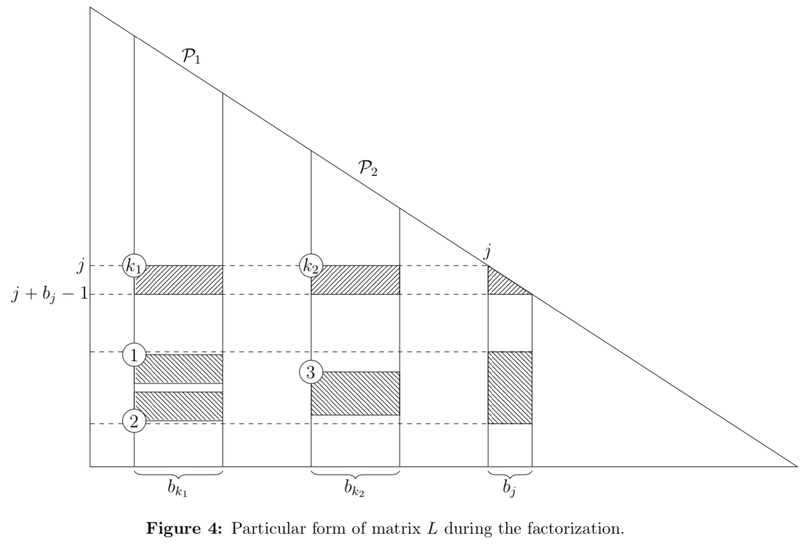
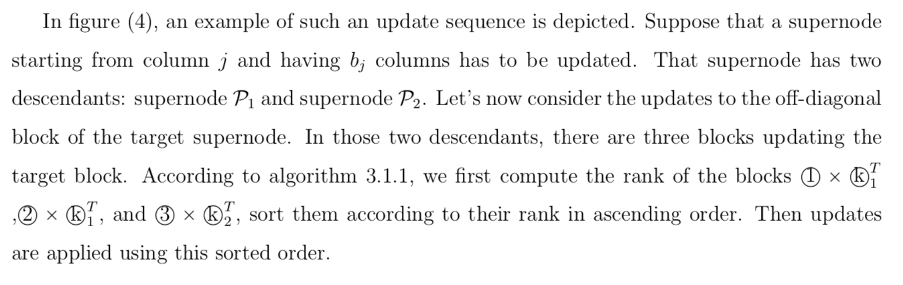
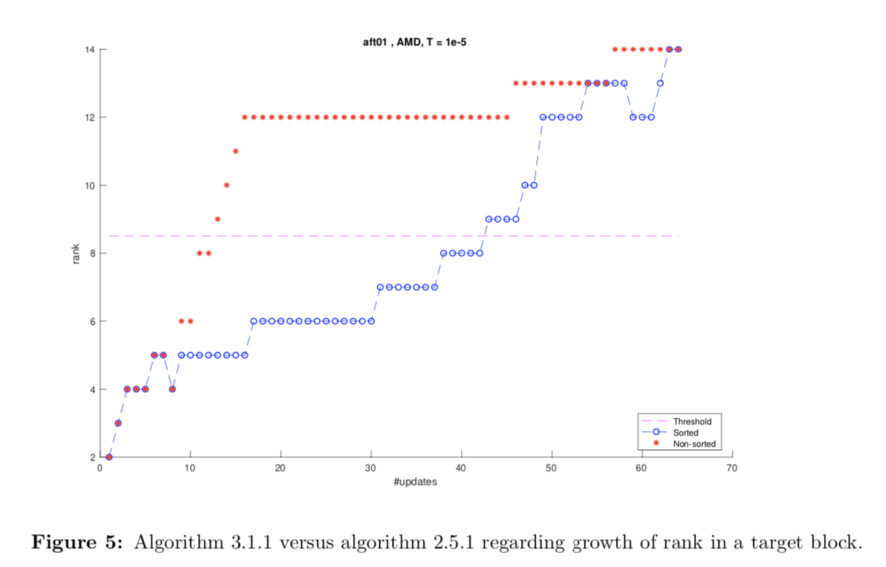

# Research Project: Direct Methods for Solving Sparse Linear System (Lawrence Berkeley National Laboratory, CA)

## Abstract:
 Multiple methods are available in the literature to solve a linear system. They are generally classified in two categories, direct methods and iterative methods. In this work, we focus on solving a sparse linear system  _Ax = b_, where *A* is symmetric positive definite. In this case, forward and backward triangular solve can be used after the Cholesky decomposition of matrix _(A = LL^T)_
 has been computed. In this work, we explore the use of Block Low- Rank Compression(BLR) in the left-looking Cholesky algorithm. To this end, we investigate sorting the updaters to a certain target block during the factorization process and it's impact on rank growth.we compare the results with a regular factorization process without sorting the updates to see the growth of the rank of the target block.

## Introduction:
Large sparse matrices  appear in scientific applications in numerous fields including discretized PDEs, optimization problems, circuit design, structural dynamics and many more.  Solving  large sparse linear systems is an important issue in academic research and in industrial applications. The development of supercomputers has provided us with the opportunity to solve these critical problems . These challanges brought some new issues such as memory consumption, accuracy, and speed, which are encountered daily by numerical analyst and mathematicians. 
## Algorithm for Cholesky Factorization
The following pseudocode (2.1.1) describes the procedure for obtaining _A = LL^T_ factorization for positive definite matrix _A_.

If we apply algorithm (2.1.1) to the sparse matrix _A_ then it suffers from _fill_ which means that _L_ has nonzeros in positions which are zero in the lower triangular part of _A_ .This  is one of the major problems in sparse solvers. We want to exploit the sparsity pattern of the matrix as much as possible to save the storage cost as well as the number of floating point operations during the factorization.  For example, we can observe the following two different situations to realize how permuting the matrix in the right order can reduce the cost of computations and helps to exploit the sparsity of the given matrix.

In this regard, we want the symmetric permutation to reorder the rows and columns of the matrix _A_ to keep _A_ symmetric and reduce the fill-in entries to the factorization.
## Organization of the factorization
As we discussed, fill-in is the major issues in the direct methods for solving large sparse linear system. So we have to do pre-processing to arrange the original matrix _A_ to get a full structure of _L_ as shown in the following diagram.

In practice, there are many fill-reducing algorithms to find permutation matrix _P_. For example, Nested Disection, Approximate Minimal Degree, Cuthill-McKee ordering, Column count ordering etc. In our work, We are using Nested Disection and Approximate Minimum Degree orderings. Once we get the matrix _P_, we apply it to _A_.  

The columns of a supernode (set of contiguous columns in the factors _L_ that share essentially the same sparsity structure) have a dense diagonal block and identical column structure below the main diagonal block.  Finding the supernodes are important since only one copy of the row subscripts for the columns of a supernode need to be stored to represent the structure of _L_, thus reducing the indexing cost. Diagonal blocks of supernode columns are of full rank and the blocks those are far from the main diagonal are likely to be of low rank so that compression algorithms can be applied to them. Furthermore, it should be clear that if it is known where each supernode begins, the symbolic factorization algorithm can be improved significantly. For example, we have presented one simple case that shows the supernode structure and corresponding elimination tree.

## Left Looking Cholesky

## Block Low Rank (BLR) Compression
Diagonal blocks of _A_ are full and off-diagonal blocks are more likely to be admissible for compression and those admissible blocks are called BLR matrices. Thus, these off-diagonal blocks can be represented through a low-rank form obtained with a compression technique such as Singular Value Decomposition(SVD) or Rank-Revealing QR (RRQR) factorization. BLR is nonhierarchical and can be seen as a flat mesh of dense or low-rank matrices. BLR can substantially decrease the memory and operation costs during the factorization. BLR achieves relatively good flop rates together with low compression costs. To use BLR compression in algorithm  (2.4.1), the matrix can first be compressed using the following scheme.

## Proposed Algorithm
In algorithm (2.5.1), updates from the descendants of a given target block are applied in sequential order from left to right. However, updates with larger ranks may incur a faster growth of the rank of the target block than updates of lower ranks. It is desirable to perform as many updates as possible on the target block until its rank violates the admissibility condition, thus meaning that compression doesn't provide any advantage anymore. Another way to formulate this is that the growth of the rank of the target block should remain as slow as possible. We propose to order the updates from the descendants by increasing order of rank. Thus, before updating the target block, we compute the ranks of all the updates from the descendants and sort them according to their rank in ascending order. AUpdates are then applied in the sorted order. The following algorithm implements this strategy.

## Illustration of Proposed Algorithm
An illustration of proposed algorithm (3.1.1) is described below.

## Results and Conclusion
We evaluate the proposed approach on a set of sample matrices from the SuiteSparse matrix collection using MATLAB solvers that we developed. We denote Approximate Minimum Degree ordering as "amd" and nested disection ordering as "dissect", and use the corresponding functions in MATLAB. As already discussed, permuting the matrices has a significant effect on reducing the fill-in entries in the Cholesky factor. Algorithm (3.1.1) was applied to these sample matrices to assess the the impact on the rank growth of updated blocks. The growth of the rank of a particular target block of matrix "aft01" using both  algorithm (3.1.1) and (2.5.1) is presented in figure (5) below. That block receives 70 updates, and the rank corresponding to the admissibility condition is represented by a horizontal line. All the updates performed under this horizontal line are performed using low-rank kernels. Once the rank grows above that line, we can not take advantage of BLR compression for that block anymore. The  red dots denote the value of the rank of the target block after each update when using algorithm (2.5.1). Using this approach, the threshold boundary is crossed quickly after 12 updates. On the other hand, the blue dots correspond to applying algorithm (3.1.1), which allows to apply 45 updates using low rank kernels before meeting the threshold. Thus, applying the updates after sorting the descendants allows to do 33 additional updates using low rank compression than the regular left-looking Cholesky algorithm (2.5.1).

In total, our proposed algorithm helps to take the advantage of BLR compression algorithm before the update in left-looking Cholesky decomposition. Our proposed model saves upto 20%-40% of computational cost compared to classical left-looking cholesky which is tremendous saving in big data problems. Our proposed algorithm seems very promising interms of computational complexity, memory consumption, and computational time.
